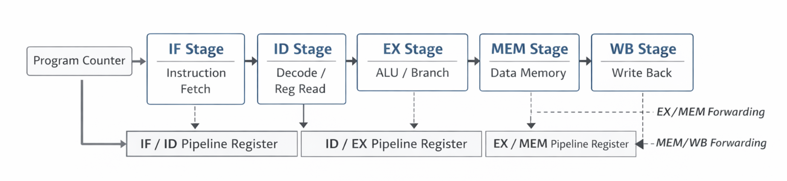

# 5-Stage Pipelined CPU Simulator (C++)

Cycle-accurate simulation of a classic **5-stage pipelined processor** implemented in C++.

The simulator models realistic pipeline behavior including data hazards, forwarding paths, and control-flow handling, following a standard MIPS-style datapath.

---
## Pipeline Datapath



---
## Architecture

The processor is divided into five pipeline stages:

- IF — Instruction Fetch  
- ID — Instruction Decode / Register Read  
- EX — Execute / Address Calculation  
- MEM — Data Memory Access  
- WB — Write Back  

Pipeline registers separate each stage, and all state updates occur on cycle boundaries.

---

## Supported Instructions

- `add rd, rs, rt`  
- `sub rd, rs, rt`  
- `lw  rt, imm(rs)`  
- `sw  rt, imm(rs)`  
- `beq rs, rt, imm` (PC-relative)  
- `nop`  

Registers `r0–r31` are supported, with `r0` hard-wired to zero.

---

## Pipeline Features

- EX/MEM and MEM/WB forwarding to resolve data hazards  
- Automatic detection of load-use hazards with single-cycle stall insertion  
- Branch resolution in EX stage with IF/ID flush on taken branch  
- Cycle-by-cycle pipeline execution trace  
- CPI (Cycles Per Instruction) measurement  

---

## Build & Run

```bash
mkdir -p build && cd build
cmake ..
cmake --build .
./pipeline ../program.asm
